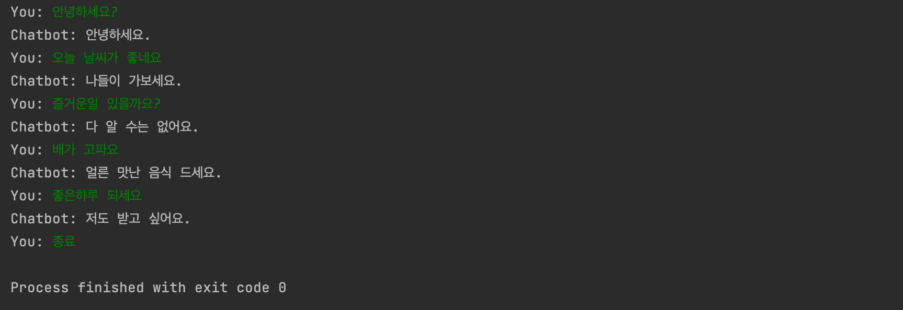

# AI 개발실무 2차 레포트

## 레벤슈타인 거리를 기반으로 한 챗봇 구현

- chatbot.py 

```
import pandas as pd
import numpy as np


class SimpleChatBot:
    def __init__(self, filepath):
        self.questions, self.answers = self.load_data(filepath)

    def load_data(self, filepath):
        data = pd.read_csv(filepath)
        questions = data['Q'].tolist()  # 질문열만 뽑아 파이썬 리스트로 저장
        answers = data['A'].tolist()  # 답변열만 뽑아 파이썬 리스트로 저장
        return questions, answers

    def find_best_answer(self, input_sentence):
        # 입력 문장에 대한 질문열과의 레벤슈타인 거리를 numpy 배열로 저장
        distances = np.array(list(map(lambda n: self.calc_distance(input_sentence, n), self.questions)))
        # 레벤슈타인 거리의 최소값 index 계산
        best_match_index = distances.argmin()
        return self.answers[best_match_index]

    # 레벤슈타인 거리 계산 함수
    def calc_distance(self, a, b):
        if a == b: return 0  # 같으면 0을 반환
        a_len = len(a)  # a 길이
        b_len = len(b)  # b 길이
        if a == "": return b_len
        if b == "": return a_len

        matrix = [[] for i in range(a_len + 1)]  # 리스트 컴프리헨션을 사용하여 1차원 초기화
        for i in range(a_len + 1):  # 0으로 초기화
            matrix[i] = [0 for j in range(b_len + 1)]  # 리스트 컴프리헨션을 사용하여 2차원 초기화
        # 0일 때 초깃값을 설정
        for i in range(a_len + 1):
            matrix[i][0] = i
        for j in range(b_len + 1):
            matrix[0][j] = j
        for i in range(1, a_len + 1):
            ac = a[i - 1]
            for j in range(1, b_len + 1):
                bc = b[j - 1]
                # print(bc)
                cost = 0 if (ac == bc) else 1  # 파이썬 조건 표현식 예:) result = value1 if condition else value2
                matrix[i][j] = min([
                    matrix[i - 1][j] + 1,  # 문자 제거: 위쪽에서 +1
                    matrix[i][j - 1] + 1,  # 문자 삽입: 왼쪽 수에서 +1
                    matrix[i - 1][j - 1] + cost  # 문자 변경: 대각선에서 +1, 문자가 동일하면 대각선 숫자 복사
                ])
        return matrix[a_len][b_len]


# CSV 파일 경로를 지정하세요.
filepath = 'ChatbotData.csv'

# 간단한 챗봇 인스턴스를 생성합니다.
chatbot = SimpleChatBot(filepath)

# '종료'라는 단어가 입력될 때까지 챗봇과의 대화를 반복합니다.
while True:
    input_sentence = input('You: ')
    if input_sentence.lower() == '종료':
        break
    response = chatbot.find_best_answer(input_sentence)
    print('Chatbot:', response)

```

- 실행결과

